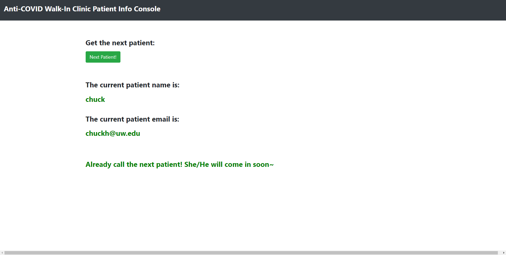

Anti-COVID
===

Project Intro
---

Due to the current pandemic, people have been asked to maintain social distancing in public space. Our team initiated an idea of developing a simple walk in clinic App to achieve the non-contact check-in process

Basic Feature and Functionality
---

- Using the queue to represent the order of patients.
- Patients can check-in by App & Arduino device, instead of contacting a real person.
- Arduino will make sound to remind patients of the time of meeting doctors.
- Arduino will send messages to the App that can call his name & room number to meet the doctors.
- Doctor can use the webpage to call the next patient and get the information of him.


Interactive End
---

- **Mobile End**: Patients login, pay, waiting and notification.
	- Android + KOTLIN + BLE

- **Arduino**: Ring to notify.

- **Frontend**: Doctor manage patients
	- React + Bootstrap

- **Database**: Maintaining patient queue and whole information.
	- Firebase

- **Server End**: Supporting communication between webpage and database.
	- Apache + PHP


Running Instruction
===

Android and Arduino 
---
1. Enter name, email address and passwaord for login. If it's first time using the app, please click `SIGN UP` for signing a new account into database.

2. Pick a service, Doctor, and Insurance company using drop down list. Choose a payment method. Then click `NEXT` for Arduino connection.

3. Once it connected, you will be on the waiting list. When server confirmed your name, your will be moved on the current position and Arduino will make sound to remind you.

4. User needs to click buttons on the Arduino board to confirm.


Webpage
---

We use React and bootstrap to build the frontend project. 

The React repo is: https://github.com/changer666666/Anti-COVID-React 

Run the React project and you can see the webpage.

1. Clone the repo
```bash
git clone https://github.com/changer666666/Anti-COVID-React.git
```

2. Download `npm` from official website
```bash
https://www.npmjs.com/get-npm
```

3. Install `React-bootstrap`
```bash
npm install react-bootstrap bootstrap
```

4. Run the React project
```bash
npm start
```
Open http://localhost:3000 and you will see the webpage~




Server
---

We use Apache and PHP to build the server. 

The Server code is in: https://github.com/changer666666/Anti-COVID/server

1. Install Apache server on local computer
- Download Apache server from https://httpd.apache.org/download.cgi. Remember to choose the correct Apache version fitting your computer OS.
- Unzip the download file. Copy it to your destination folder.

2. Environment setup
Edit the configuration file in Apache folder:
- Change `SVRROOT` in `httpd.conf`. It should be the path of apache server.
- You can use `apache/bin/httpd.exe` to test the syntax correctness of configuration file.

3. Put the cloned React project into `apache/htdocs` folder.

4. Run the Apache service
- Click the `apache/bin/ApacheMonitor.exe` to run the Apache server.
- Click `Start` button to start Apache service.
- If the installation fail, you can double click `vc_redist.x86.exe` to install. Then start Apache.

5. Test Apache service.
- Open the` http://localhost` or `http://127.0.0.1`.
- If you can see the Apache Home page, it means you install Apache successfully~


Reference
===

Website:
[React-bootstrap] (https://react-bootstrap.github.io/)

[Firebase Admin SDK for PHP] (https://firebase-php.readthedocs.io/en/latest/overview.html)

[Build a Contact Form with React and PHP] (https://blog.bitsrc.io/how-to-build-a-contact-form-with-react-js-and-php-d5977c17fec0)

